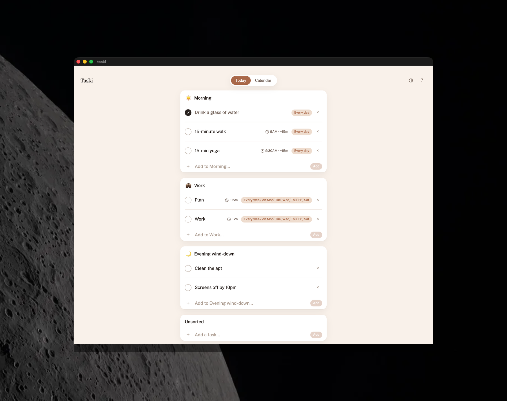

# Taski

A native Mac to-do app for routines that reset instead of nagging. Group tasks into named routines that check off and start fresh each day, let anything recur on its own schedule, and keep one-off life-admin in a simple "Unsorted" list — no streaks, no red, no guilt.

**Universal binary** — runs natively on both Apple Silicon and Intel Macs.

<p align="center">
  
</p>

## Download

**[Download for Mac →](https://github.com/hey-niia/taski/releases/latest)**

Taski is unsigned, so on first launch macOS will say it "cannot be opened because the developer cannot be verified." Right-click the app → **Open** → **Open** again, or run:

```
xattr -cr /Applications/Taski.app
```

## The story

This started as a to-do app for my wife, who has ADHD. The specific thing it's built against is how an unstructured day quietly turns into working until midnight — not from a lack of trying, but because nothing external gave the day a shape. Most to-do apps make that worse: streaks that break, overdue items that turn red, a running score of how behind you are. None of that helps someone whose problem is executive function, not motivation.

I did the design research properly rather than guessing — [RESEARCH.md](RESEARCH.md) is the literature review, checked against every decision already made. The clearest, most defensible finding wasn't about color (ADHD doesn't change hue perception) — it was that red's alarm association is a *learned convention*, exactly the emotional register this app opts out of, and that light sensitivity is dramatically more common in ADHD adults (69% vs. 28% in one clinical review), which is the actual case for building real theming instead of guessing at one "correct" palette.

The product idea that came out of that: **routines**, not tasks with due dates, are the right unit for structure. A "Morning" routine that resets every day gives the start of the day a shape without anyone deciding anything; a one-off task like "renew car insurance" doesn't need to belong to a routine at all, so it lives in a plain "Unsorted" list instead of being forced somewhere it doesn't fit.

## What I actually did here

I design software for a living but had never shipped a native Mac app myself, and a Tauri + Rust + Swift stack was new ground. I directed Claude Code through the whole build — architecture, every UI decision, and the research — rather than writing the Rust or Swift myself. A few of the calls along the way:

- Choosing routines-with-recurrence over due-dates-with-tags as the core model, and deciding a one-off task shouldn't be forced into a routine to be useful.
- Reading the actual ADHD/UX literature before deciding on the palette and motion rules, instead of assuming "ADHD-friendly" meant a specific color — and writing down where the evidence was strong versus thin ([RESEARCH.md](RESEARCH.md)).
- Rejecting an early redesign pass that quietly turned "overdue" red and asking for it back out — the app's whole premise is that overdue shouldn't look like an alarm.
- Catching repeated pixel-level misalignments between the routine header icon, the task checkbox, and the composer row that I kept sending back until they were actually identical, not just close.
- Asking for the routine icon field to become a real searchable emoji picker (like the native macOS picker or Slack's) instead of a text field you type or paste an emoji into.
- Directing the on-device icon-suggestion feature: a new routine's icon is suggested automatically by Apple's on-device Foundation Models framework, editable by hand at any time — no cloud call, no account.

## What it does

- **Routines** — named, reorderable groups of tasks (e.g. "Morning", "Work", "Evening wind-down"), each with its own icon, suggested on-device when you create it.
- **Recurrence** — daily, weekly on specific days, or a custom interval, computed with `rrule`; anything can recur, not just routine tasks.
- **Drag-and-drop reordering** — within a routine or between routines, via a hover-revealed handle that stays out of the way otherwise.
- **Calendar** — an Upcoming list grouped by day, or a Month grid with a day-detail panel, both backed by the same completion history.
- **Four themes** — Paper, Clay, Sky, and Dusk (a dark mode), covering the light-sensitivity gap the research turned up.
- **No red, no streaks** — overdue tasks get a plain reschedule option, not an alarm color or a broken-streak notice.

## Development

```
npm install
rustup target add aarch64-apple-darwin x86_64-apple-darwin
npm run tauri dev
```

Release builds ship as a universal binary (`npm run tauri build -- --target universal-apple-darwin`) — `scripts/build-sidecar.sh` builds the Swift sidecar for both architectures in one Mach-O so it lands correctly in either arch's app bundle.

Requires macOS 26 (Tahoe) or later for the on-device icon-suggestion sidecar (Apple's Foundation Models framework, Apple Silicon only); everything else runs on Intel Macs too. Built with Tauri v2 (Rust) + React + TypeScript + Tailwind v4, SQLite via `tauri-plugin-sql`, `@dnd-kit` for drag-and-drop, and `rrule` for recurrence. `src/app` has the data/theme stores, `src/screens` the two top-level screens, `src/components` the UI, `src-tauri/sidecar/icon-suggester` the Swift on-device summarizer.

## License

MIT
